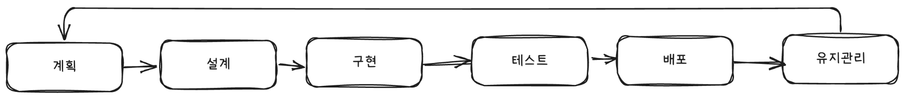

# 소프트웨어 개발 수명 주기

#### 1. SDLC란 무엇이며 왜 중요할까요?

여러분이 새로운 집을 짓는 건축가라고 상상해 보세요. 설계도나 계획 없이 당장 벽돌부터 쌓기 시작할까요? 아닙니다. 집을 짓기 위해서는 설계, 자재 준비, 건설, 검사, 사후 관리라는 체계적인 과정을 거쳐야 합니다.&#x20;

소프트웨어 개발 수명 주기(SDLC, Software Development Life Cycle)는 이처럼 소프트웨어를 개발하는 데 필요한 모든 과정을 체계화하고 구조화한 방법론입니다.

SDLC의 목표는 간단합니다. 비용 효율적이고 시간 효율적인 방식으로 고품질의 소프트웨어를 개발하는 것입니다. 이 프로세스는 프로젝트의 위험을 최소화하고, 모든 이해관계자(고객, 개발자, 관리자)가 동일한 목표와 기대치를 가지고 협력하게 만드는 시스템적인 틀을 제공합니다.

SDLC를 통해 얻을 수 있는 주요 이점은 다음과 같습니다.

* 높은 가시성: 개발 과정 전체가 투명하게 공개됩니다.
* 효율적인 관리: 정확한 추정, 계획, 일정 수립이 가능합니다.
* 위험 감소: 단계별 검증을 통해 문제가 커지기 전에 미리 발견하고 해결합니다.

고객 만족도 증대: 고객의 요구 사항을 충족하는 소프트웨어를 체계적으로 제공합니다.

#### 2. SDLC의 여섯 가지 핵심 단계

SDLC는 일반적으로 소프트웨어의 아이디어가 탄생하는 순간부터 사용자의 손을 떠날 때까지 다음의 여섯 가지 주요 단계를 순차적 또는 반복적으로 거칩니다.

**1단계. 계획 (Planning)**

이 단계는 소프트웨어 개발 프로젝트의 기초와 타당성을 확립합니다.

* 주요 활동: 시장 조사, 비용-편익 분석(이 소프트웨어를 만드는 것이 경제적으로 가치가 있는가?), 필요한 자원(인력, 시간, 예산) 추정.
* 결과물: 소프트웨어 요구 사항 사양(SRS) 문서 초안 작성. 이 문서는 우리가 무엇을 만들 것인지, 어떤 목표를 달성할 것인지 정의합니다.

**2단계. 요구 사항 분석/설계 (Design)**

계획 단계에서 정의한 '무엇(What)'을 '어떻게(How)' 만들지 설계하는 단계입니다.

* 주요 활동: 기술 스택(사용할 프로그래밍 언어, 데이터베이스 등) 결정, 시스템 아키텍처(소프트웨어의 전체 구조) 설계, 사용자 인터페이스(UI/UX) 구상.
* 결과물: 시스템 설계 문서, 데이터베이스 모델, 아키텍처 다이어그램 등.

**3단계. 구현/코딩 (Implementation)**

설계도를 바탕으로 실제로 코드를 작성하는 단계입니다.

* 주요 활동: 개발 팀이 설계를 따라 작은 모듈 단위로 코드를 작성하고 통합합니다. 이 단계에서 개발자의 역량과 코딩 표준 준수 여부가 중요합니다.

**4단계. 테스트 (Testing)**

작성된 코드가 고객의 요구 사항을 충족하는지, 오류(버그)는 없는지 확인하는 단계입니다.

* 주요 활동: 단위 테스트, 통합 테스트, 시스템 테스트, 인수 테스트 등 다양한 테스트를 수행합니다. 최근에는 개발 단계와 동시에 테스트를 진행하는 경우가 많습니다 (TDD, Shift-left testing).

**5단계. 배포 (Deployment)**

테스트가 완료된 소프트웨어를 사용자가 실제로 사용할 수 있는 환경(운영(Production) 환경)으로 내보내는 단계입니다.

* 주요 활동: 소프트웨어 패키징, 운영 서버 환경 설정, 설치 및 출시. 고객이 사용하는 버전과 개발자가 작업하는 환경(빌드/테스트 환경)은 분리되어 관리됩니다.

**6단계. 유지 관리 (Maintenance)**

소프트웨어가 운영 환경에서 출시된 후에도 수명을 다할 때까지 지속적으로 관리하는 단계입니다.

* 주요 활동: 발견된 버그 수정, 새로운 보안 취약점 패치, 사용자 피드백을 반영한 기능 개선 및 업그레이드. SDLC는 이 단계에서 다시 계획 단계로 돌아가 새로운 개선 주기를 시작할 수 있습니다.

#### 3. SDLC 모델 비교: 폭포형 vs. 애자일

SDLC의 단계를 어떻게 배열하고 실행하느냐에 따라 다양한 개발 모델이 생겨납니다. 이 중 가장 고전적인 모델인 폭포형과 현대적인 개발 환경을 대표하는 애자일 모델을 비교해 보겠습니다.

| 구분       | 폭포형 모델 (Waterfall Model)                                                            | 애자일 모델 (Agile Model)                                                                                   |
| -------- | ----------------------------------------------------------------------------------- | ------------------------------------------------------------------------------------------------------ |
| 개념       | 모든 단계를 순차적으로 진행하며, 이전 단계가 완전히 완료되어야 다음 단계로 넘어갈 수 있습니다. (설계 → 구현 → 테스트)              | SDLC 전체를 짧은 개발 주기(Sprint)로 나누어 반복적으로 진행하며, 요구 사항, 계획, 결과를 지속적으로 평가합니다.                                 |
| 업계 및 사용처 | 국방, 항공우주, 건설, 금융 등 규제가 엄격하거나 요구 사항이 불변해야 하는 프로젝트                                    | 스타트업, 모바일 앱, 웹 서비스, 이커머스 등 시장 변화가 빠르고 사용자 피드백이 중요한 프로젝트                                                |
| 주요 사용 이유 | 요구 사항 변경이 불가능하거나 비용이 매우 큰 경우, 또는 엄격한 감사/규제를 위해 모든 과정을 문서화하고 사전에 승인받아야 하는 경우에 적합합니다. | 시장 요구에 빠르게 대응하고, 고객에게 최소 기능 제품(MVP)을 신속하게 제공하여 피드백을 즉시 반영하며, 불확실성을 수용해야 하는 경우에 효율적입니다.                 |
| 조직 문화    | 계층적, 형식적, 문서 중심                                                                     | 협력적, 유연함, 결과 중심                                                                                        |
| 문화적 차이   | **예측 가능성 중시:** 상부에서 하달된 계획과 문서가 절대적 기준이 됩니다. 책임 소재가 명확하고, 각 부서가 맡은 일만 하는 경향이 강합니다.  | **적응성 중시:** 고객 및 이해관계자와의 지속적인 소통을 가장 중요시합니다. 개발팀은 자기 주도적이고, 변화를 두려워하지 않으며, 팀원 간의 신뢰와 협업을 통해 문제를 해결합니다. |

한줄로 요약하면 아래와 같습니다.

* **폭포형:** 한 번에 모든 것을 계획하고 실행하는 방식. 정해진 길을 따라 정확하게 가야 하는 프로젝트에 적합합니다.
* **애자일:** 작은 단위로 쪼개어 빠르게 만들고 피드백을 받아 수정하며 나아가는 방식. 목표는 알지만 길을 탐색하며 가야 하는 프로젝트에 적합합니다.

\
