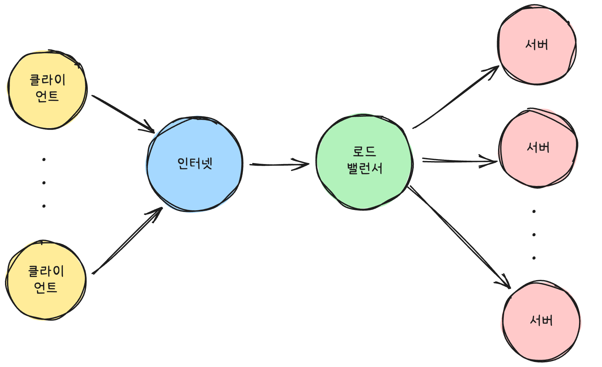
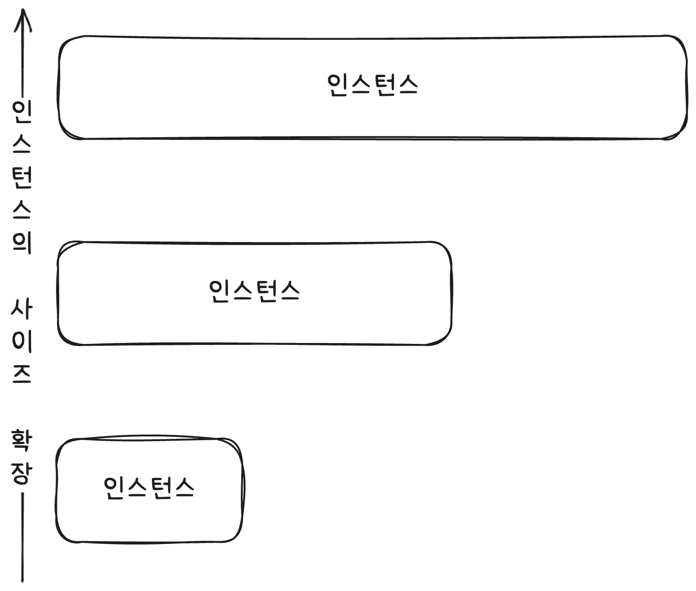
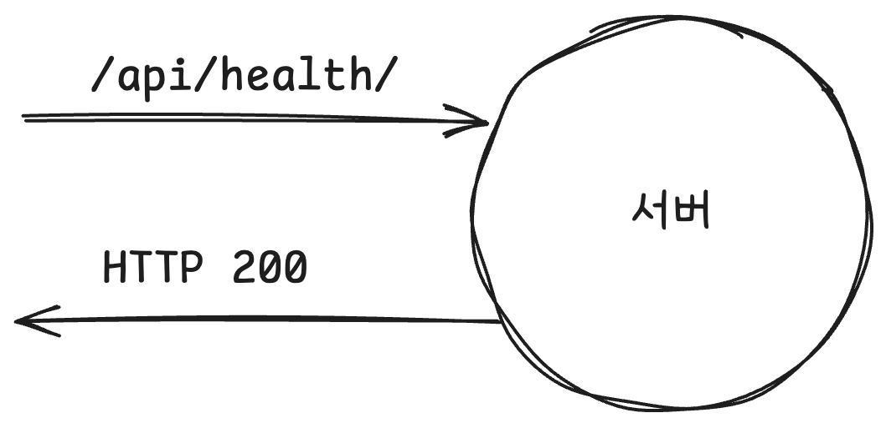

# 소프트웨어 배포

### 1. 소프트웨어 배포란 무엇인가?

SDLC(소프트웨어 개발 수명 주기)의 여섯 단계 중 마지막 단계이자, 개발 팀의 노력이 실질적인 사용자 가치로 전환되는 결정적인 과정이 바로 소프트웨어 배포(Software Deployment)입니다.

배포는 최종 사용자가 사용할 수 있도록 소프트웨어를 운영(Production) 환경에 전달하는 프로세스입니다. 즉, 개발된 소프트웨어를 실제 고객이 접근하여 사용할 수 있도록 운영 환경으로 옮겨서 작동시키는 모든 과정을 포괄합니다. 이는 단순한 파일 복사를 넘어, 다음과 같은 일련의 활동을 포함합니다.

1. 설치 및 구성: 테스트를 마친 최종 빌드(코드 묶음)를 서버, 클라우드 인프라 또는 컨테이너 환경에 설치합니다.
2. 환경 설정 적용: 데이터베이스 연결 정보, 보안 키, 환경 변수 등 해당 운영 환경에 맞는 설정을 적용합니다.
3. 서비스 활성화: 로드 밸런서(부하 분산 장치)에 새 버전을 연결하고, 구 버전을 제거하거나 트래픽을 서서히 전환하여 사용자가 새로운 서비스에 접속할 수 있도록 준비합니다.

> **로드 밸런서(Load Balancer)**&#xB294; 들어오는 네트워크 트래픽을 여러 대의 서버(백엔드 서버 또는 애플리케이션 서버)에 효율적이고 고르게 분산시켜 주는 장치 또는 소프트웨어입니다. 이는 특정 서버 한 대에 부하가 집중되어 성능이 저하되거나 서비스가 중단되는 것을 방지하고, 모든 서버가 가진 자원을 최대한 활용하여 서비스의 가용성(Availability)과 확장성(Scalability)을 높이는 핵심적인 역할을 합니다. 로드 밸런서는 단순히 트래픽을 나누는 것 외에도 서버의 건강 상태(Health Check)를 지속적으로 확인하여 문제가 있는 서버에는 트래픽을 보내지 않고, 새로운 서버를 추가할 때 자동으로 트래픽 분배 대상에 포함시키는 기능도 수행합니다.

> **시스템 가용성(Availability)**&#xC740; 시스템이나 애플리케이션이 정상적으로 작동하여 사용자가 필요할 때 접근하고 사용할 수 있는 시간의 비율을 의미합니다. 이는 시스템이 다운되지 않고 지속적으로 서비스할 수 있는 능력을 나타내며, 일반적으로 백분율로 측정됩니다(예: '99.999% 가용성'은 '파이브 나인'이라 불리며 연간 다운타임이 극히 짧음을 의미합니다). 높은 가용성을 확보하는 것은 서비스가 예기치 않은 하드웨어 장애, 소프트웨어 오류, 또는 네트워크 문제 발생 시에도 신속하게 복구되거나 중단 없이 운영되도록 보장하여 비즈니스 연속성을 유지하는 데 필수적입니다.

> **확장성(Scalability)**&#xC740; 시스템이나 애플리케이션이 증가하는 사용자 수나 데이터 양, 트래픽 부하 등을 효과적으로 처리할 수 있는 능력을 의미합니다. 이는 단순히 현재의 부하를 감당하는 것을 넘어, 미래에 더 큰 성장이 발생했을 때 추가적인 자원(서버, 메모리 등)을 투입하여 성능 저하 없이 원활하게 서비스할 수 있는 유연성을 나타냅니다. 확장성은 주로 서버를 더 좋은 사양으로 업그레이드하는 수직적 확장(Vertical Scaling)과, 로드 밸런서와 같은 기술을 사용하여 서버의 개수를 늘리는 수평적 확장(Horizontal Scaling)으로 구분됩니다.

 

> 서버의 건강 상태 또는 **헬스 체크(Health Check)**&#xB294; 시스템이 현재 정상적으로 작동하고 트래픽을 처리할 준비가 되어 있는지를 주기적으로 확인하는 일련의 검증 과정입니다. 로드 밸런서와 같은 분산 시스템 구성 요소가 서버의 특정 포트나 URL에 요청을 보내 응답 시간, 상태 코드(예: HTTP 200 OK), 또는 내부 지표를 확인하여 서버의 상태를 파악합니다. 이 검사를 통해 서버에 문제가 발생했다고 판단되면, 로드 밸런서는 해당 서버로의 트래픽 전송을 즉시 중단하고(서비스 격리), 오류가 있는 서버를 격리하여 서비스의 전반적인 안정성과 가용성을 유지하는 데 결정적인 역할을 합니다.

### 2. 배포가 중요한 세 가지 이유

배포 단계의 효율성과 안정성은 소프트웨어 비즈니스의 성공에 직접적인 영향을 미치기 때문에 매우 중요합니다.

**1. 사용자에게 가치를 전달하는 마지막 관문**

아무리 잘 설계되고 버그 없이 완벽하게 구현된 코드라도, 최종 사용자에게 전달되어 실제로 작동하지 않으면 쓸모가 없습니다. 배포는 기술적 산출물을 비즈니스적 가치로 전환하는 유일한 경로입니다.

**2. 안정성 및 신뢰성 확보**

배포 과정은 소프트웨어의 다운타임(서비스 중단 시간)과 직결됩니다. 배포 절차가 체계적이지 않고 수동적인 단계를 포함하면, 휴먼 에러(사람의 실수)나 예상치 못한 설정 오류로 인해 운영 중인 서비스에 심각한 장애가 발생하기 쉽습니다. 안정적인 배포 프로세스는 서비스의 신뢰성을 보장합니다.

**3. 지속적인 개선(CI/CD)의 핵심**

애자일 방법론에서는 고객의 피드백을 신속하게 반영하는 것이 중요합니다. 빠르고 반복적인 배포가 가능해야만 작은 기능 개선이나 버그 수정을 즉시 적용할 수 있으며, 이는 곧 시장의 변화에 민첩하게 대응하는 경쟁력으로 이어집니다.

> CI/CD는 소프트웨어 개발 및 배포 과정을 자동화하여 더 빠르고 안정적으로 애플리케이션을 사용자에게 제공하는 방법론입니다. CI (Continuous Integration, 지속적 통합)는 개발자들이 작성한 코드를 중앙 저장소에 자주 병합하고 자동으로 빌드 및 테스트하여 잠재적인 오류를 초기에 발견하는 것을 목표로 합니다.  이어서 CD (Continuous Delivery 또는 Continuous Deployment, 지속적 제공 또는 지속적 배포)는 통합 및 테스트를 마친 코드를 자동으로 스테이징 환경이나 프로덕션 환경까지 배포하는 단계를 의미합니다. 이 전체 프로세스를 파이프라인(Pipeline)으로 구축함으로써 개발팀은 잦고 신뢰성 있는 릴리스를 통해 시장 변화에 빠르게 대응하고 사용자 피드백을 신속하게 반영할 수 있게 됩니다.

### 3. 과거와 현재의 배포 방식: 자동화의 필요성

과거 소프트웨어 배포는 매우 수동적이고 시간 소모적인 작업이었습니다.

**1. 과거의 수동 배포 방식**

개발자가 서버에 직접 로그인하여 빌드된 파일을 복사하고, 서비스 재시작 명령어를 수동으로 입력하며, 설정 파일을 직접 수정하는 방식이 일반적이었습니다.

* 문제점:
* 잦은 오류: 사람이 직접 명령어를 입력하고 설정을 바꾸는 과정에서 휴먼 에러가 발생할 확률이 높았습니다.
* 느린 속도: 배포에 많은 시간이 소요되어 하루에 한 번 또는 주 단위 배포가 일반적이었습니다.
* 추적 및 롤백의 어려움: 문제가 생겼을 때 어떤 버전이 깔려 있는지 추적하기 어렵고, 문제가 발생한 경우 이전 안정 버전으로 되돌리는 롤백(Rollback) 작업이 복잡하고 어려웠습니다.

> 롤백(Rollback)은 소프트웨어 배포나 시스템 업데이트 후에 치명적인 오류나 예기치 않은 문제가 발생했을 때, 문제가 생기기 직전의 안정적인 상태로 시스템을 되돌리는 행위를 말합니다. 이는 마치 안전벨트처럼, 새로운 변경사항(코드, 설정, 데이터베이스 스키마 등)을 프로덕션 환경에 적용했으나 심각한 버그나 성능 저하가 발생하여 서비스를 계속할 수 없을 때 사용됩니다. 롤백을 통해 문제가 없는 이전 버전의 애플리케이션이나 구성을 즉시 재배포하여 사용자 경험의 중단을 최소화하고 시스템의 안정성을 신속하게 회복시키는 것을 목표로 합니다.

**2. 현대의 자동화된 배포**

이러한 문제들을 해결하기 위해, 현대 소프트웨어 개발에서는 자동화된 배포 파이프라인(CI/CD)과 컨테이너 기반 배포가 필수적인 요소가 되었습니다.

* CI/CD (지속적 통합/지속적 배포): 코드가 변경될 때마다 빌드, 테스트, 배포 과정을 자동으로 처리하는 시스템입니다. 이를 통해 배포 시간을 수동 방식 대비 획기적으로 줄이고 오류를 최소화합니다.
* 컨테이너 (Docker, Kubernetes): 소프트웨어와 그 실행 환경을 표준화된 패키지(컨테이너)로 묶어 어디서든 동일하게 작동하도록 보장합니다. 이는 개발 환경과 운영 환경 간의 차이로 인한 오류를 줄이고 배포의 신뢰성을 극대화합니다.

> **컨테이너(Container)**&#xB294; 운영 체제 수준에서 애플리케이션과 그 실행에 필요한 모든 것(코드, 런타임, 시스템 도구, 라이브러리 등)을 격리하여 패키징하는 기술입니다. 이것은 마치 작고 독립적인 배송 상자와 같아서, 애플리케이션이 개발 환경, 테스트 환경, 그리고 실제 운영 환경 등 어떤 인프라 위에서도 일관되고 신뢰성 있게 실행되도록 보장합니다.
